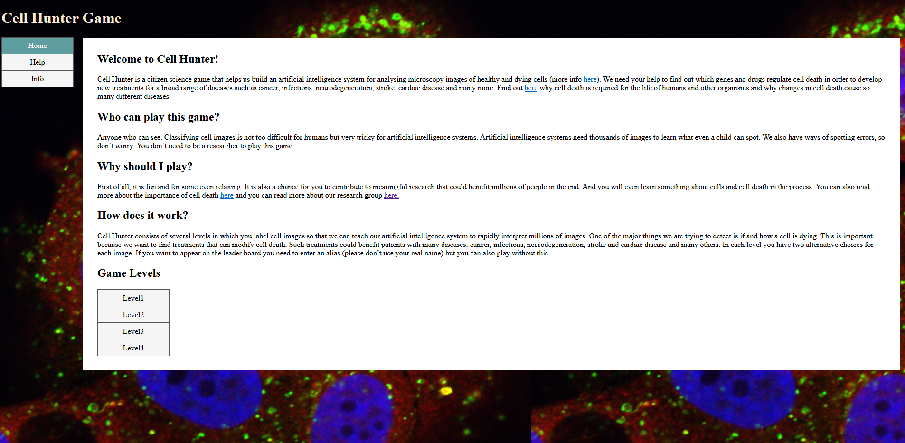

## Online_Game


#### This project is created at 2019 for Cell death dataset annotation.

#### by Salma Kazemi Rashed

##### PhD candidate in Cell Death, Lysosomes and AI Group, Lund university

#### PI: Sonja Aits


## 1. Conda environment
To run the tool on a personal system, one only needs to create the Conda environment.

``` bash
conda create -n YourENV python=3.6

pip install flask

pip install mysql-connector  ##This is for Cloud version

```

or 
´
```bash
pip install -r requirements.txt #using pip
```
or

```bash
conda create --name <env_name> --file requirements.txt
```

## 2. Run the code

The next step is running main.py function:

```bash
python main.py
```

open the Localhost http://127.0.0.1:8080/ on your browser.


Afterward, the start page can be accessed via any web browser.

The labels are then saved in a SQLite database in a local version, while the images are stored in the static directory of the project.

To familiarize users with the game's features and prepare them for annotating real images, we included a practice section that covers all the necessary aspects.


The laymen annotation handling is Annotations directory.

Online_Game is the local version and it has only 100 images from each channel. The main 500 images version is on Lunarc or other HPCs.


3. Game Demo




